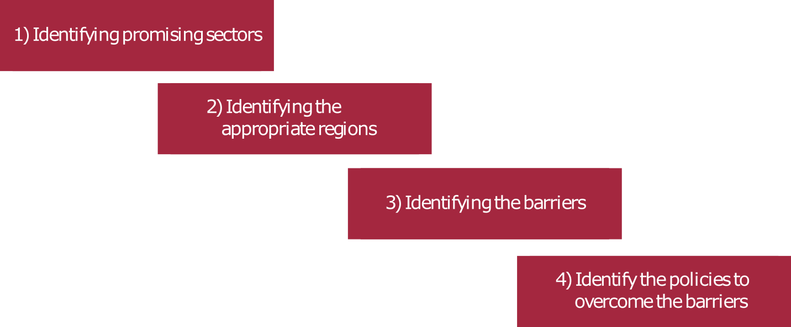

# Conclusion {-}

Europe’s business model of selling more of the same in new markets is reaching its limits as
the pace at which new markets emerge slows, while new competitors that sell the same products emerge quickly. One strategy to restore economic growth in Europe would be to embark
on exporting new products that promise higher value added and growing markets. One such
area could be low-carbon technologies. In the framework of global decarbonisation and the
desire to reduce resource consumption, the market for low-carbon technologies has been
growing fast – and is likely to continue to do so.

In terms of European potential we assessed different criteria:

1. Strength of current exports: 
Strong exports are a powerful signal that a country is (relatively) better at producing
certain goods or services. Different EU countries already have comparative advantages in a
number of low-carbon technologies. For example Denmark, Germany and Spain are major
exporters of wind turbines.

2. Strength of current innovation: 
Other EU countries might have the potential to develop comparative advantages based on
their specialisation in innovation in these new fields. For example, Germany is already strong
in patenting electric vehicle technology and might turn this into a comparative advantage

3. Innovation strength in nearby technologies: 
The Czech Republic and the UK have so far not excelled in patenting and exporting wind
turbines – but their specialisation in innovation in nearby technologies suggests that some of
the technological prerequisites for strengthening innovation in wind technology and ultimately boosting exports are present. Although modest in absolute terms, some central and
east European countries exhibit specialisation in technologies related to electric vehicles and
photovoltaic cells.

4. Regional clusters: 
Finally we find that – while only Belgium is good at exporting batteries and no EU country
is good at inventing batteries – several regional clusters exist that are generating significant
battery technology patents. These clusters might be the nuclei of future growth.

We can therefore conclude that the EU has potential, but that one-size-fits-all policies
would ignore the complexity of the task of supporting the EU economy to gain a competitive
edge in new products and services that will form the basis for future growth and jobs. To
identify policies to foster future competitiveness we suggest a four-step filter (below), with
each step, as much as possible, based on transparent criteria. This would also enable ex-post
evaluation – which in the medium term allows the policy toolbox to be improved.

{#yo}

