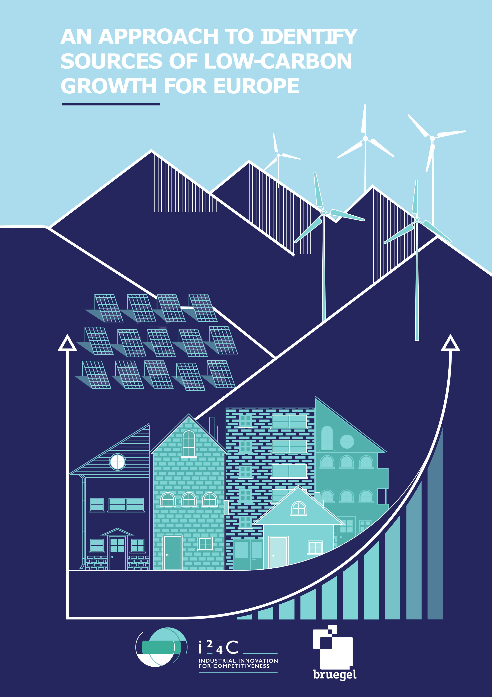

--- 
title: "An approach to identify the sources of low-carbon growth for Europe"
author: "Georg Zachmann"
date: "`r Sys.Date()`"
site: bookdown::bookdown_site
output: bookdown::gitbook
documentclass: book
bibliography: [book.bib, packages.bib]
biblio-style: apalike
link-citations: yes
github-repo: robertkck/ecf
description: "Draft website for the European Climate Foundation"
cover-image: "images/cover.png"
twitter-handle: GeorgZachmann
---

# Preface {-}

This website serves to illustrate the findings of the policy contribution "An approach to identify the sources of low-carbon growth for Europe" [@zachmann] and allows a deeper dive into the underlying data.  The website is focused on presenting figures and deliberately only offers curt descriptions/interpretations. It is currently structured into five chapters but we plan to extend it when further steps of our analysis become available.

The research underlying this report has been fnancially supported by the European Climate Foundation’s Industrial Innovation for Competitiveness Initiative (i24c).

